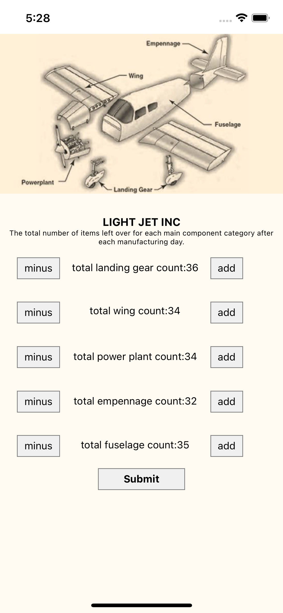

# PLANE MANUFACTURER HANGER

Light Jet Inc Supply chain counter demonstrates counting and submitting the total number for each of the 5 Main Components of it's light body Aircraft at the end of the manufacturing line so that the procurement department knows when to re-stock.

To insure productivity the counter cannot go below 30 items for each component, this is when procurement knows when to restock its #aircraft parts.
This Example uses react-native, flow for type checking and redux with axios GET and PUT request to a remote firebase URL.

Aircraft components:
• Fuselage
• Wings
• Empennage
• Power Plant
• Landing Gear

##### Setup node modules

```
yarn install or npm install
```

##### Setup Pod files

```
cd ios

pod install
```

##### Start

```
npx react-native start
```



1. **Each counters initial state is set to 30 and consists of a button to increase or decrease the amount, a text showcasing the current amount and a button to decrease the amount.**

2. **When the user pressed add or minus the changes take place in real time on the firebase console**

3. **When the user submits the app sends a PUT request with the state of the counters preserving it inside of the firebase realtime database**

4. **The app then loads the updated state back onto the view of the app.**

5. **Once the count reaches 30 the count is disabled and no integer is shown indicating that new components must be ordered**
